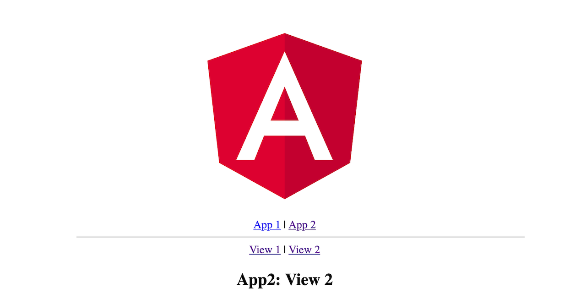

# [Combining Multiple Angular Applications into a Single One](https://medium.com/disney-streaming/combining-multiple-angular-applications-into-a-single-one-e87d530d6527)

[Live Demo](https://angular-toolbox.github.io/Working-with_Projects/)



## Generate the base structure

### Generate main app and workspace

```bash
ng new workspace --routing --style scss
cd workspace
```

### Create additional apps

```bash
ng generate application --routing app1 --style scss
ng generate application --routing app2 --style scss
```

### Generate a component

```bash
ng generate component components/view1 --project=app1 --module=app.module.ts
ng generate component components/view2 --project=app1 --module=app.module.ts
ng generate component components/nav   --project=app1 --module=app.module.ts

ng generate component components/view1 --project=app2 --module=app.module.ts
ng generate component components/view2 --project=app2 --module=app.module.ts
ng generate component components/nav   --project=app2 --module=app.module.ts

ng generate component components/nav
```

## Customize Components: Main App

### Edit ```src/app/app.module.ts```

```javascript
import { BrowserModule } from '@angular/platform-browser';
import { NgModule } from '@angular/core';

import { AppRoutingModule } from './app-routing.module';
import { AppComponent } from './app.component';

import { App1SharedModule } from 'projects/app1/src/app/app.shared.module';
import { App2SharedModule } from 'projects/app2/src/app/app.shared.module';
import { NavComponent } from './components/nav/nav.component';

@NgModule({
    declarations: [AppComponent, NavComponent],
    imports: [
        BrowserModule,
        AppRoutingModule,
        App1SharedModule.forRoot(),
        App2SharedModule.forRoot()
    ],
    providers: [],
    bootstrap: [AppComponent]
})
export class AppModule {}
```

### Edit ```src/app/app-routing.module.ts```

```javascript
import { NgModule } from '@angular/core';
import { Routes, RouterModule } from '@angular/router';

import { App1SharedModule } from 'projects/app1/src/app/app.shared.module';
import { App2SharedModule } from 'projects/app2/src/app/app.shared.module';

const routes: Routes = [
    { path: 'app1', component: App1SharedModule },
    { path: 'app2', component: App2SharedModule },
    { path: '**', redirectTo: 'app1/view1' }
];

@NgModule({
    imports: [
        RouterModule.forRoot(routes),
        App1SharedModule.forRoot(),
        App2SharedModule.forRoot()
    ],
    exports: [RouterModule]
})
export class AppRoutingModule {}
```

### Edit ```src/app/app.component.ts```

```javascript
export class AppComponent {
    title = 'working-with-projects';
}
```

### Replace ```src/app/app.component.html```

```html
<div style="text-align:center">
    <h1>Welcome to {{ title | uppercase }}</h1>
    
</div>

<app-nav></app-nav>
<br /><br>
<router-outlet></router-outlet>
```

### Replace ```src/app/components/nav/nav.component.html```

```html
<div style="text-align:center">
    <a routerLink="/app1">App 1</a> | <a routerLink="/app2">App 2</a>
</div>
```

## Customize Components: App1

### Edit ```projects/app1/src/app/app.module.ts```

```javascript
import { View1Component } from './components/view1/view1.component';
import { View2Component } from './components/view2/view2.component';
import { NavComponent }   from './components/nav/nav.component';

@NgModule({
    declarations: [AppComponent, View1Component, View2Component, NavComponent],
    ...
```

### Edit ```projects/app1/src/app/app-routing.module.ts```

```javascript
import { View1Component } from './components/view1/view1.component';
import { View2Component } from './components/view2/view2.component';

const routes: Routes = [
    { path: 'app1/view1', component: View1Component },
    { path: 'app1/view2', component: View2Component },
    { path: 'app1', redirectTo: 'app1/view1' }
    ];
```

### Create ```projects/app1/src/app/app.shared.module.ts```

```javascript
import { NgModule, ModuleWithProviders } from '@angular/core';

import { AppModule } from './app.module';

const providers = [];

@NgModule({})
export class App1SharedModule {
    static forRoot(): ModuleWithProviders {
        return {
            ngModule: AppModule,
            providers: providers
        };
    }
}
```

### Replace ```projects/app1/src/app/app.component.html```

```javascript
    <router-outlet></router-outlet>
```

### Replace ```projects/app1/src/app/components/nav/nav.component.html```

```html
    <a routerLink="/app1/view1">View 1</a> | <a routerLink="/app1/view2">View 2</a>
```

### Add to ```projects/app1/src/app/components/view2/view2.component.ts```

```javascript
    export class View1Component implements OnInit {
        title = 'App1: View 1';
```

### Replace ```projects/app1/src/app/components/view1/view1.component.html```

```html
    <app-nav></app-nav>
    <p>{{ title }}</p>
```

### Replace ```projects/app1/src/app/components/view2/view2.component.html```

```html
    <app-nav></app-nav>
    <p>{{ title }}</p>
```

## Customize Components: App2

Do the same as for App1, but replace every ```App1``` with ```App2``` and every ```app1``` with ```app2```

## Adding a library

```bash
    ng generate library code-formatter
```

